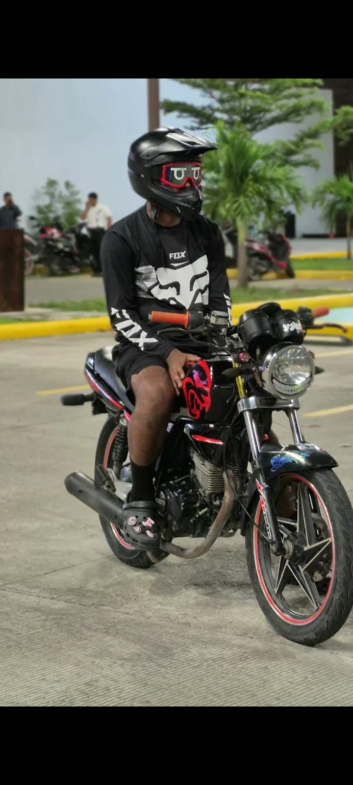

<!DOCTYPE html>
<html lang="es">
<head>
<meta charset="UTF-8">
<meta name="viewport" content="width=device-width, initial-scale=1.0">
<title>Misión: Felicidad 2026</title>
<link href="https://googleapis.com" rel="stylesheet">

</head>
<body>

    <button class="start-btn" onclick="startSystem()">INICIAR SISTEMA</button>

    
NUEVOS HORIZONTES

    
MEJORES DESTINOS

    
    

        STATUS: EN LINEA
        AÑO: 2026
    

    

        

        
    

    

        > NIVEL DE FELICIDAD
        

            

        

        
        > PROCESANDO DESEOS...
        

            

        

    

</body>
</html>
